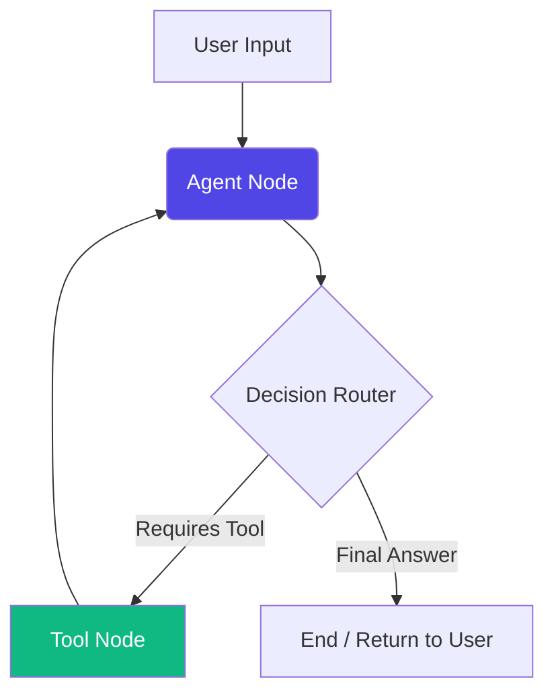

# 📱 Telecom AI Agent POC
**Architecture, AI Workflow, and System Design**
*Proof of Concept Overview*

---

# 1. 🏗️ High-Level Architecture
The application is a full-stack containerized system.

- **Frontend (React)**: User and Admin dashboards with real-time AI chat.
- **Backend (FastAPI)**: REST API handling auth, database ops, and LangGraph orchestration.
- **Database (PostgreSQL + PGVector)**: Stores users, customer data, and vectorized knowledge base.
- **AI Engine (Ollama)**: Local LLM and Embedding execution.
- **Observability (Langfuse)**: Deep LLM tracing and token monitoring.

---

# 2. 🧠 Models & Hardware Selection

We use **Ollama** to run models locally within the Docker network.

### LLM: `qwen2.5:7b`
- Highly capable open-weights model in the 7B parameter class.
- Exceptional at strict **tool calling** (function calling) and following complex system prompts.
- Efficient enough to run on local hardware (GPUs or modern CPUs).

### Embeddings: `nomic-embed-text`
- Produces highly contextual 768-dimensional vectors.
- Extremely fast for both ingestion and retrieval, perfect for a RAG architecture.

---

# 3. 🔄 LangGraph Orchestration Workflow

The AI operates as a state machine using LangGraph.

*The Agent Node evaluates the conversation state, checks the Step Count constraint, and decides whether to respond directly or invoke specialized tools.*

---

# 4. 📚 RAG (Retrieval-Augmented Generation)

Our Knowledge Base relies on PostgreSQL with the `pgvector` extension.

- **Chunking Strategy**: We use `RecursiveCharacterTextSplitter` with `chunk_size=1000` and `chunk_overlap=200`. This ensures context (like sentences splitting across pages) is not lost.
- **Embedding**: PDFs and text snippets are vectorized into 768-D arrays.
- **Retrieval Engine**: We utilize **Cosine Distance** (`similarity_search_with_score`).
- **Filtering**: We strictly filter out chunks with a cosine distance `> 0.5`. This guarantees the model doesn't hallucinate based on loosely related text.

---

# 5. 🛠️ Tools & System Instructions

The Agent is restricted to 5 explicit tools to prevent hallucination:
1. `get_customer_package`: Retrieves active plan.
2. `get_data_balance`: Retrieves exact GB balance.
3. `change_customer_package`: Initiates plan migration.
4. `create_support_ticket`: Files formal tickets with descriptions.
5. `retrieve_context`: Queries the RAG Vector DB.

**Instruction Rules (System Prompt)**
- *Rule:* Never make up policies. Only cite sources returned by `retrieve_context`.
- *Rule:* Do not execute destructive actions without explicit user confirmation.
- *Rule:* Prompt for missing tool parameters (e.g., ticket description) before calling a tool.

---

# 6. 📊 Observability & Logging

We implemented a custom, state-of-the-art telemetry system.

- **Context Tracking**: Uses Python's `ContextVar` to track unique `request_id`s asynchronously across LangGraph nodes.
- **In-Memory Trace Assembly**: Captures `ENTER`, `TOOL_CALL`, `RAG_QUERY`, and `LLM_RESPONSE` events in real-time.
- **Database Persistence**: Once `REQUEST_END` fires, the assembled JSON trace is permanently written to the `orchestration_logs` table in PostgreSQL.
- **Visual Dashboard**: Admins can view the exact thought process, node transitions, and RAG distances in a color-coded UI.

---

# 7. 🗄️ Relational Database Schema

Alongside vector storage, Postgres handles structured business logic:

1. **`users`**: Manages authentication, passwords, and Role-Based Access (Admin vs Customer).
2. **`customer_data`**: The mock CRM containing data balances and active packages.
3. **`chat_history`**: Persistent, chronologically ordered chat logs.
4. **`support_tickets`**: Tracks customer complaints and statuses.
5. **`orchestration_logs`**: Stores persistent JSONB telemetry traces.

---

# 8. 🛡️ Edge Cases & Handling

- **Infinite Loop Cap**: If the LLM gets stuck calling tools recursively, a hardcap of `step_count = 6` forcibly routes the graph to END and suggests filing a support ticket.
- **Stateless Confirmation**: The `pending_action` dictionary is passed out of the backend and stored in the React UI state, securely preventing state loss across HTTP requests when confirming plan changes.
- **Hardware Fallback**: Startup scripts dynamically check for `nvidia-smi`. If a GPU is missing, the system silently and successfully falls back to CPU mode without crashing.
- **Safe Vector Resets**: The Admin "Clear KB" utilizes `delete_collection` instead of dropping schemas, preserving the DB integrity.

---

# 9. ⚠️ Error Handling

- **Database Resilience**: Uses SQLAlchemy async sessions injected via FastAPI `Depends`, ensuring connections are cleanly rolled back and closed on failure.
- **RAG Missing Collections**: Built-in failsafes gracefully return "No knowledge base found" to the LLM instead of crashing the backend if the PGVector schema is empty.
- **Tool Validation**: If a tool fails (e.g., bad parameter), the error string is injected back into the LangGraph state so the LLM can self-correct and try again.
